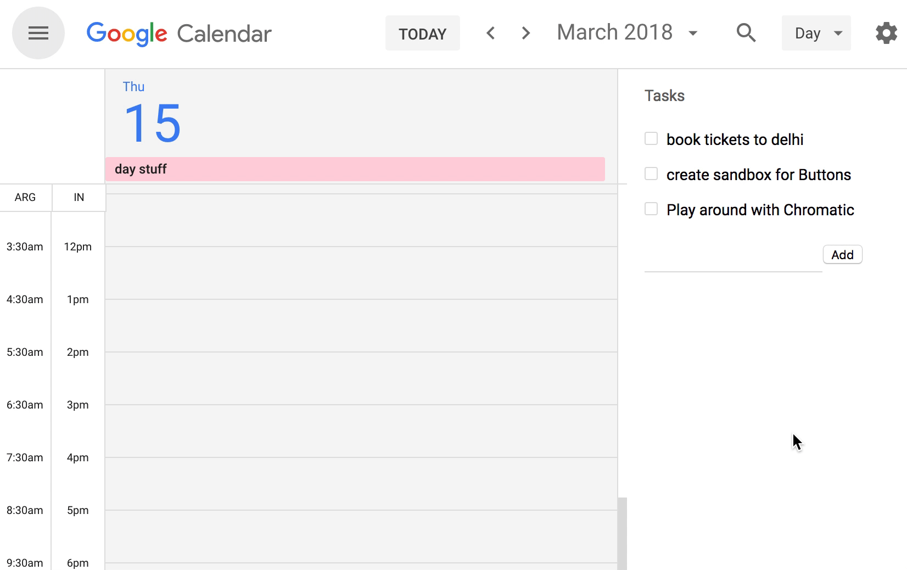

### what the what?

&nbsp;

Problem: My schedule and tasks are in different apps. I want them in the same app so I can plan my day quickly. Google calendar has tasks, but it's not good enough.

Solution: I built a better thing, keep tasks next to calendar, schedule them when planning.

⚠️ this is based on [ideas @thekitze is working on](https://twitter.com/thekitze/status/968224110068236288)

&nbsp;&nbsp;

### Demo

&nbsp;

&nbsp;&nbsp;

### Install

Download build.zip from [releases](https://github.com/siddharthkp/calendar-tasks/releases), unpack it and load it as an unpacked extension. [Instructions here](https://stackoverflow.com/questions/24577024/install-chrome-extension-not-in-the-store)

&nbsp;&nbsp;

### Known bugs/TODOs:

* Only works when the Tasks panel is open.
* It waits for 2s before render, if the internet is slow, it doesn't work
* Doesn't let you change the color, lame.

### Want to contribute?

Please don't? Sorry, I have no intention of maintaining this. [Use @thekitze's app](https://twitter.com/thekitze/status/968224110068236288)

&nbsp;&nbsp;
